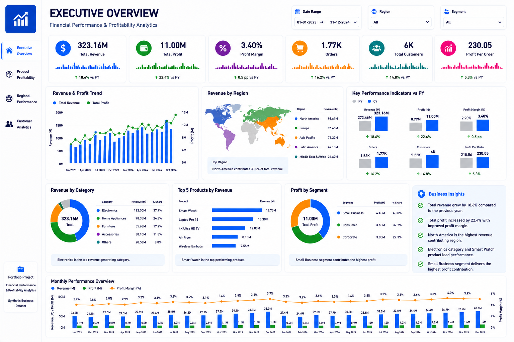
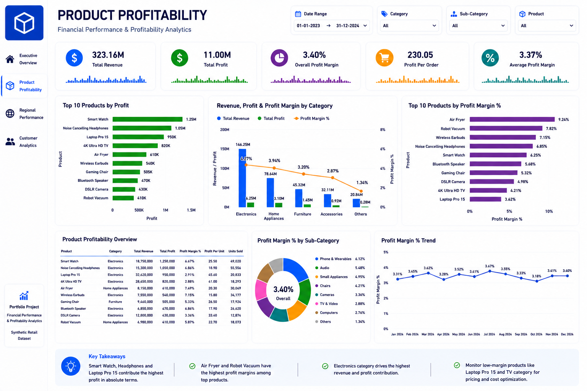
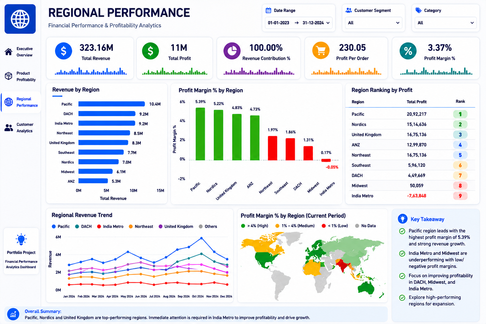
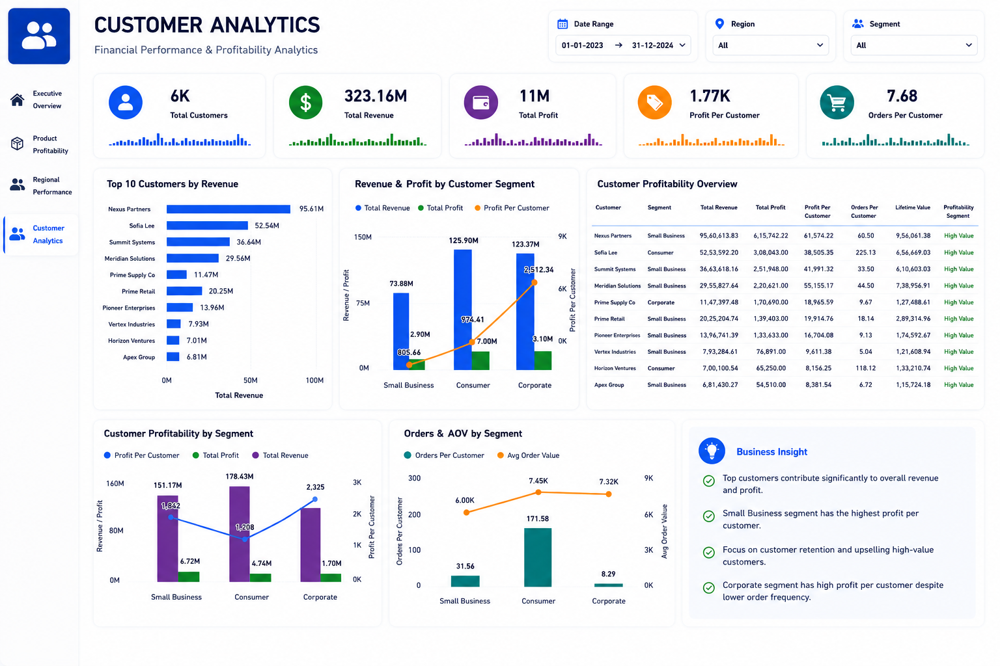

# Financial Performance & Profitability Analytics Dashboard

## Project Overview
This project is a complete Business Intelligence solution built using **Power BI** to analyze company-wide financial performance, product profitability, regional sales performance, and customer analytics.

The dashboard provides deep insights into:

- Revenue trends
- Profitability analysis
- Product category performance
- Regional sales contribution
- Customer segmentation
- Profit margin analysis

---

## Objective
The goal of this project is to transform raw business data into actionable insights for decision-making.

This dashboard helps businesses answer:

- Which products generate the highest profit?
- Which regions perform best?
- Who are the most valuable customers?
- What factors impact profitability?

---

## Tools Used
- Power BI
- SQL
- Excel
- DAX
- Data Modeling

---

## Dashboard Pages

### 1. Executive Overview
Key KPIs:
- Total Revenue
- Total Profit
- Profit Margin
- Total Orders

Insights:
- Overall business performance
- Monthly revenue trend
- Profit contribution breakdown

---

### 2. Product Profitability Analysis
Key Metrics:
- Product-wise Revenue
- Profit by Category
- Profit Margin %

Insights:
- Top profitable products
- Low-performing products
- Category comparison

---

### 3. Regional Performance Analysis
Key Metrics:
- Region-wise Revenue
- Region-wise Profit
- Regional Profitability %

Insights:
- Best performing region
- Weak regions
- Market penetration analysis

---

### 4. Customer Analytics
Key Metrics:
- Customer Lifetime Value
- Repeat Purchase Rate
- Customer Segment Revenue

Insights:
- Top customers
- Segment profitability
- Customer behavior analysis

---

## DAX Measures Used

```DAX
Total Revenue = SUM(Sales[Revenue])

Total Profit = SUM(Sales[Profit])

Profit Margin = DIVIDE([Total Profit],[Total Revenue],0)

Total Orders = COUNT(Sales[Order_ID])

Average Order Value = DIVIDE([Total Revenue],[Total Orders],0)
```
---

## Dashboard Preview

### Executive Overview


### Product Profitability


### Regional Performance


### Customer Analytics


## Business Impact

This dashboard helps management to:

- Improve profit margins
- Identify high-performing products
- Optimize regional sales strategy
- Track customer retention
- Support data-driven decision making

## Skills Demonstrated

- Data Cleaning
- Data Modeling
- DAX Calculations
- KPI Development
- Dashboard Design
- Business Intelligence
- Financial Analysis
- Customer Analytics

## Project Structure

```text
Financial-Performance-Profitability-Analytics-System/
│── data/
│   ├── raw/                 # Raw input dataset
│   ├── samples/             # Sample datasets
│   ├── staging/             # Intermediate transformed data
│   ├── warehouse/           # Final analytics-ready data
│
│── docs/
│   ├── screenshots/         # Dashboard screenshots
│   ├── architecture.md      # Project architecture
│   ├── business_questions.md
│   ├── data_dictionary.md
│
│── excel/
│   ├── exports/             # Exported reports
│
│── planning/
│   ├── README.md            # Planning documentation
│
│── powerbi/
│   ├── data/
│   ├── README.md            # Power BI notes
│   ├── semantic_model_notes.md
│
│── python/                  # Python ETL / automation scripts
│── scripts/                 # Deployment scripts
│── sources/                 # Source references
│── sql/                     # SQL schema and analysis queries
│── tests/                   # Testing scripts
│
│── .gitignore
│── LICENSE
│── README.md
```
## Author

Nitu Kumari  
Data Analyst | Power BI Developer | Backend Engineer